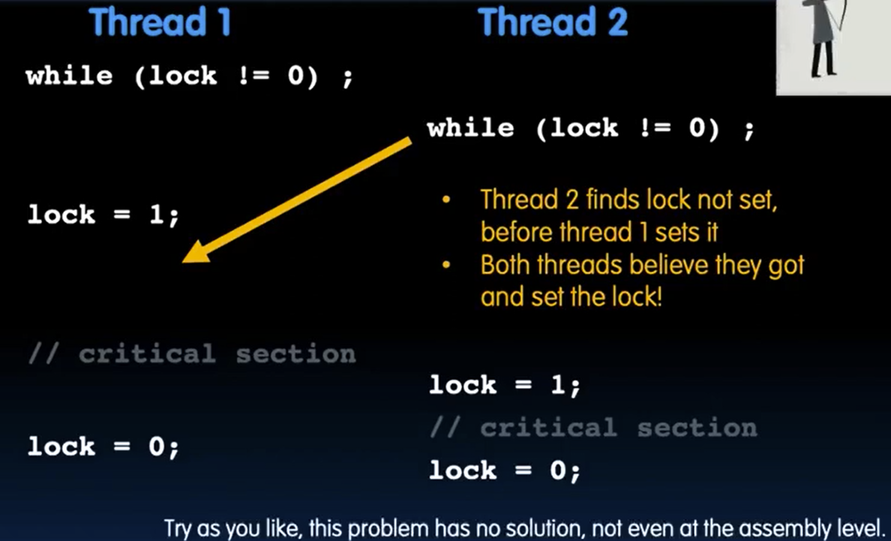

# 34. VM II Performance

VM Performance

<figure><figcaption></figcaption></figure>

Typical Performance Stat

<figure><figcaption></figcaption></figure>

Impact of Paging on AMAT

<figure><figcaption></figcaption></figure>

<figure><figcaption></figcaption></figure>

IO Devices

How to Interact with Devices

<figure><figcaption></figcaption></figure>

ISA for IO

<figure><figcaption></figcaption></figure>

Memory Mapped IO

<figure><figcaption></figcaption></figure>

Processor & IO Speed Mismatch

<figure><figcaption></figcaption></figure>

IO Polling

Processor checks status, then Act

<figure><figcaption></figcaption></figure>

IO Interrupts

<figure><figcaption></figcaption></figure>

Polling Interrupts and DMA

<figure><figcaption></figcaption></figure>

DMA

<figure><figcaption></figcaption></figure>

<figure><figcaption></figcaption></figure>

DMA: Incoming Data

<figure><figcaption></figcaption></figure>

DMA: Outgoing Data

<figure><figcaption></figcaption></figure>
