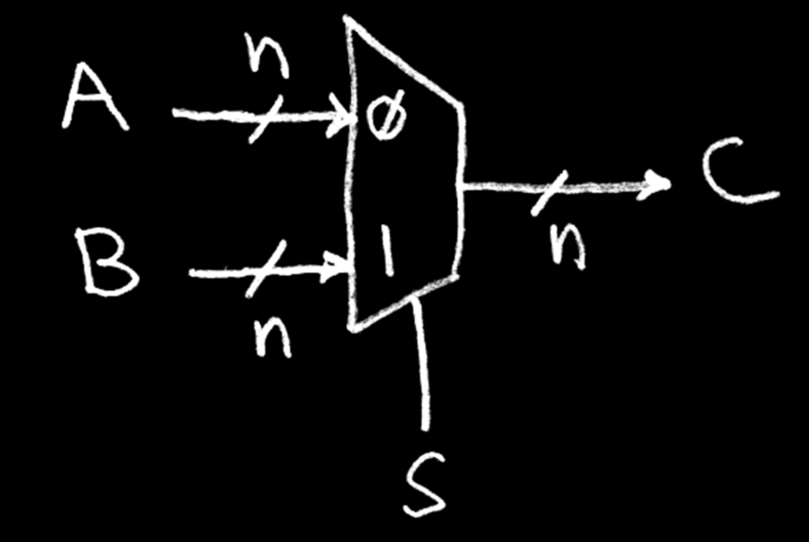

# 35. TLB

## Exceptions in a 5-Stage Pipeline

* Traps are handled similarly to pipeline hazards.
* In RISC-V, the exception cause can be inferred by the faulting instruction and its current pipeline stage.

<figure><figcaption></figcaption></figure>

## The Trap Handler

* Save the state of the current program.
  1. Save ALL of the registers!
* Determine what caused the exception/interrupt.
* Handle exception/interrupt, then do one of two things:

Continue execution of the program:

* Restore program state.
* Return control to the program.

Terminate the program:

* Free the program resources, etc.
* Schedule a new program.

## Handling Context Switches

* Recall the context switch:
  * OS switches between processes (i.e., programs) by changing the internal state of the processor.
  * Allows a single processor to "simultaneously" run many programs.
* At a high-level:
  * The OS sets a timer. When it expires, perform a hardware interrupt.
  * Trap handler saves all register values, including:
    * Program Counter (PC)
    * Page Table Register (SPTBR in RV321)
      * The memory address of the active process's page table.
  * Trap handler then loads in the next process's registers and returns to user mode.

## Handling Page Fault

* Recall page faults:
  * An accessed page table entry has valid bit off → data is not in DRAM.
* Page faults are handled by the trap handler.
  * The page fault exception handler initiates transfers to/from disk and ‹ performs any page table updates.
  * (If pages needs to be swapped from disk, perform context switch so that another process can use the CPU in the meantime.)
    * ideally need a "precise trap" so that resuming a process is easy.)
  * Following the page fault, re-execute the instruction.
* Side note: Write protection violations also trigger exceptions.

## System Calls and Launching Applications

* A system call (syscall) is a "software interrupt" that allows a program to request a service from the operating system.
  * Similar to a function call, except now executed by kernel.
  * Examples:
    * Creating and deleting files; reading/writing files;
    * Accessing external devices (e.g., scanner);
    * printf, malloc, etc. (ecalls in RISC-V); etc.
    * Launch a new process
* Suppose shell (a user process) wants to launch a new app:
  * Shell forks (in Linux): a syscall that traps into the OS kernel process
  * OS (supervisor mode): Load program (see CALL); jump to start of main. Return to user mode.
  * Shell: "wait" for main to return (join)

[https://youtu.be/1mz-ztcwbZk](https://youtu.be/1mz-ztcwbZk)

## What Happens at Boot?&#x20;

* The CPU executes instructions from some start address stored in Flash ROM.
* Then, the BIOS (Basic Input Output System) firmware loads the bootloader, which loads the OS kernel.
  * BIOS: Find a storage device and load the first sector (block of data).
  * Bootloader. (stored on, e.g., disk) Load the OS kernel from disk into a location in memory and jump into it.
  * OS Boot. Initialize services, drivers, etc.
  * Init. Launch an application (e.g., Terminal/Desktop/...) that waits for input in loop.

## Caches vs. Primary Memory

* Blocks, pages, (bytes, words) are all units of memory.
* Caches: blocks
  * On modern systems, \~64B.
* Memory: pages
  * On modern systems, \~4KiB.

<figure><figcaption></figcaption></figure>

## Caches vs. Page Tables

"Cache" Paradigm: Data at each level is a quick-access copy of data at a lower level in the memory hierarchy.

* A Page Table translates addresses.
  * Page tables store physical page numbers, not data.
* Page tables facilitate Demand Paging.
  * Cache data pages in memory.
  * Access disk pages only when needed by the process.
  * Page Table keeps track of page status/location.

<figure><figcaption></figcaption></figure>

## Caching vs. Demand Paging

<figure><figcaption></figcaption></figure>

## Modern Virtual Memory Systems

Modern Virtual Memory Systems use address translation to provide the illusion of a large, private, and uniform storage.

1. Privacy means Protection:
   1. Several users/processes, each with their own private address space.
2. Uniform storage means Demand Paging:
   1. The ability to run programs larger than primary memory (DRAM).
   2. Hides difference in machine configurations.

Price: Address translation on each memory reference.

Page tables in memory significantly increase average memory access time!

<figure><figcaption></figcaption></figure>

## Speeding Up Address Translation

* Good Virtual Memory design should be fast (\~1 clock cycle) and space efficient.
  * Every instruction/data access needs address translation.
* But if page tables are in memory, then we must perform a page table walk per instruction/data access:
  * Single-level page table: 2 memory accesses.
  * Two-level page table: 3 memory accesses.
* Solution: Cache some translations in the .. Translation Lookaside Buffer (TLB).

<figure><figcaption></figcaption></figure>

## The TLB Is a Cache for Address Translations

* The Translation Lookaside Buffer (TLB) caches page table entries.
  * TLB hit: → Single-cycle translation
  * TLB miss. → Page table walk to refill.
* TLB Reach: Size of largest virtual address space that can be simultaneously mapped by the TLB.
* TLB design: 38-128 entries.
  * Typically fully associative (increase TLB reach by minimizing conflicting entries).
  * Random/FIFO replacement policy.

<figure><figcaption></figcaption></figure>

## Tag, Index, and Offset

TIO for Virtual Addresses and Physical Addresses are unrelated!

<figure><figcaption></figcaption></figure>

## Memory Access: TLB, Cache, DRAM, Page Table

1. Can a cache hold the requested data if the corresponding page is notin main memory? -> No!
2. On a memory reference, which block should we access first? When should we translate virtual addresses?
   1. We will assume Physically Indexed, Physically Tagged caches (other designs exist).
   2. This means TLB first, then cache.

<figure><figcaption></figcaption></figure>


The TLB now does the translation.

Not the page table!!


## Virtual Memory and the CPU Pipeline

Virtual Memory = address translation + protection + demand paging.

* Each instruction/data access = address translation + functional checks.
* Should handle:
* TLB Miss: Needs a mechanism to refill TLB (usually done in hardware).
* Page Fault (i.e., page on disk)
  * Needs a precise trap so that software handler can easily re-execute instruction after page retrieval
* Protection violation check
  * A violation may abort the process, e.g., SEGFAULT.

<figure><figcaption></figcaption></figure>

<figure><figcaption></figcaption></figure>

## Virtual Memory Action Flowchart

<figure><figcaption></figcaption></figure>

## Handling Context Switches and TLBs

* Context switches should be fast. Avoid DRAM/disk updures.
  * Keep all page tables for all currently running processes in DRAM.
  * Instead, ensure that all TLB entries refer to the active process.
* The high-level context switch:
  * The OS sets a timer. When it expires, perform a hardware interrupt.,
  * Trap handler saves all register values, including:
    * Program Counter (PC)
    * Page Table Register (SPTBR in RV321)
      * The memory address of the active process's page table.
  * Trap handler also sets all TLB entries to invalid. (other strategies exist)
  * Trap handler then loads in the next process's registers and returns to user mode.

## A Full, Page-Based Virtual Memory Machine

(Assume page tables are held in untranslated physical memory)

<figure><figcaption></figcaption></figure>

[https://youtu.be/eVIsejli9hU](https://youtu.be/eVIsejli9hU)
